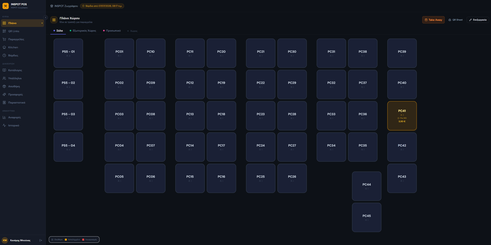
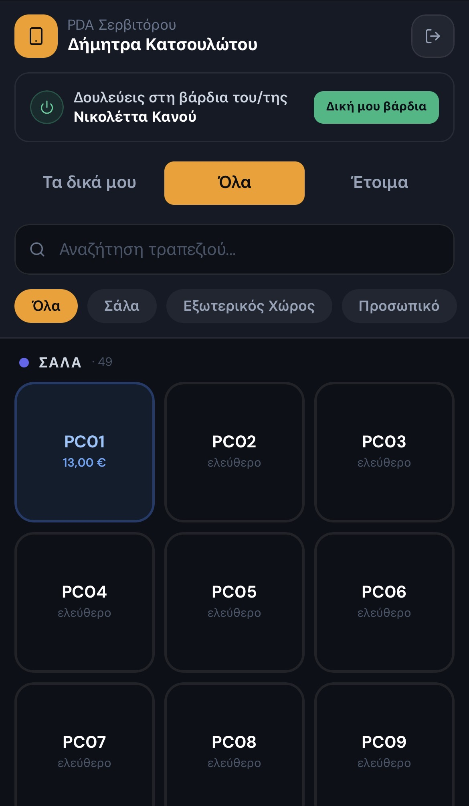
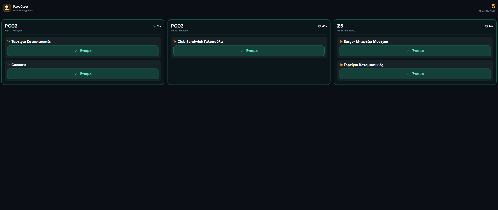
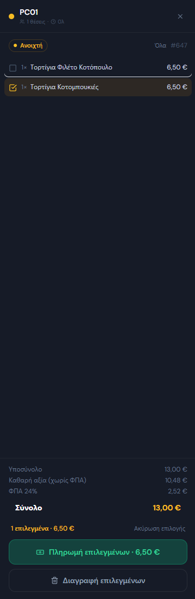
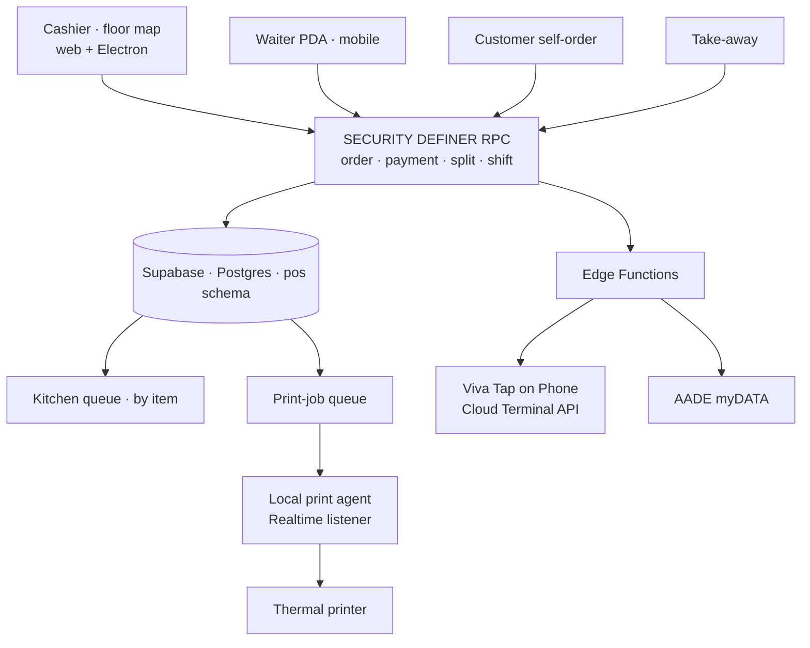

<!--
  CASE-STUDY README for INSPOT POS.
  -> Public repo (e.g. "inspot-pos") = this README + /docs screenshots. Code stays private.
  -> Add screenshots to /docs and update the image paths.
-->

# 🧾 INSPOT POS — Order-Taking System for a Gaming-Café Chain

**An in-house point-of-sale where four different order channels — cashier, waiter PDA, customer self-order, and take-away — all flow into one database, one kitchen, and one printer. Built for a 3-location chain, running in production.**

> 🔒 **Source is private** to protect business IP. This is a documented case study — happy to walk through the codebase live in an interview.

---

## Screenshots

<!-- Drop images into /docs and update these paths -->
| Cashier · floor map | Waiter PDA | Kitchen display | Split payment |
|---|---|---|---|
|  |  |  |  |

---

## The problem

The chain runs gaming cafés in three cities, each pairing PC/gaming stations with a full food-and-drink venue and kitchen. Ordering was manual and didn't scale — handwritten tickets, verbal relay to the kitchen, no unified view per store or across the group.

Off-the-shelf POS systems meant per-terminal monthly fees, lock-in to closed hardware, and no fit for a gaming café — where a customer sits at a station for hours and re-orders repeatedly without getting up. So the system was built in-house, tailored to exactly how the venues operate.

## The challenge

This was never "a cash register." It's one system that had to cover, at once:

- **Four different order sources** — cashier with a floor map, waiter on a mobile handheld (PDA), customer self-ordering from their seat, and take-away — all landing in the same database, kitchen, and printer.
- **Greek tax compliance** — every receipt transmitted to the tax authority (AADE) via **myDATA**. Not a feature; a condition of operating.
- **Card payments without rented terminals** — **Viva Tap on Phone**, turning the store's own phone into a card terminal.
- **Thermal printing from anywhere** — an order can start on a phone at the back of the room, but the paper must come out at the cashier's printer, even though a mobile browser can't see that printer.
- **Multiple stores, one codebase** — shared catalogue logic but independent data, shifts and tills per store, with group-wide reporting on the horizon.

## Architecture

Web-first (React + TypeScript + Vite + Tailwind), also packaged as an Electron desktop app for the cashier. The backend is entirely **Supabase**: PostgreSQL with a dedicated `pos` schema, business logic in **SQL RPC functions**, **Edge Functions** for external integrations (tax, payments), and **Realtime** for anything that must happen *now*. Deployed on Vercel, with each store on its own domain that pre-selects the active store.

**The decisive design choice:** the critical logic — create order, pay, split-pay, close shift, kitchen queue — lives in **RPC functions inside the database**. Every device (cashier, PDA, customer phone) runs exactly the same code; permissions are enforced with `SECURITY DEFINER` without requiring an auth session for PIN users; and a fix to the payment flow reaches every store instantly, often with no deploy at all.

## The four order flows

- **Cashier & floor** — a live floor map of tables and stations, where occupancy is *computed from active orders* (so a table can never get "stuck"). The order modal has search, categories, priced modifiers, per-item notes, and happy-hour pricing. On send, kitchen items are auto-routed to the queue by a DB trigger and a ticket prints.
- **PDA** — the waiter signs in by PIN on their phone, sees tables in a mobile layout, and works a **PDA sub-shift tied to the main shift** (closing the main shift closes the PDA shifts and attributes their takings correctly). Tickets print at the cashier as if sent from there.
- **Self-order** — the customer orders from their seat; the order enters a pending state and the cashier gets an audible alert (a two-tone klaxon designed to cut through café noise, repeating every 5s until accepted or rejected, auto-rejecting after 2 minutes so no one is left waiting).
- **Take-away** — off-table orders with their own flow and numbering.

## Kitchen display

The kitchen screen shows a queue of **items, not orders** — because that's how a kitchen actually works. Each item carries its table, order number, notes and wait time, and leaves the screen only when marked ready. A key principle that came from a real incident: **paid ≠ prepared.** When a customer split-pays their fries before they're out, the fries must stay in the queue — they're still waiting on them. The queue keeps unprepared items visible even after payment, with a safety window so old unmarked items don't haunt the screen.

## Payments, split payments, tax

Cash or card. For cards, the system integrates **Viva Tap on Phone** via the Cloud Terminal API: the cashier sends the amount to the phone-terminal and tracks the outcome by **polling every 5s** — a deliberate choice made after Viva's webhooks proved unreliable, which made the flow independent of any inbound call.

**Split payment** settles selected items: it creates a new paid order for those items, recomputes the table balance, and issues a receipt only for what was paid. Discounts (amount or %) and tips are supported per transaction. Every receipt gets a unique daily number, is recorded with **per-item VAT breakdown**, and is transmitted to AADE via myDATA from an Edge Function — with status tracking so failed transmissions retry.

## Printing: a queue instead of localhost

Thermal printing from a web app is a classic wall — the browser can't talk to USB/network printers, and the "HTTP-to-localhost agent" trick breaks the moment the order comes from a different device. The solution: **print jobs via the database.** Every device writes a print job to Supabase; a small local **agent** on the cashier machine watches the queue over Realtime and prints receipts, kitchen tickets and shift reports. No browser→localhost, no dependency on the origin device — the waiter's phone order prints at the cashier in seconds.

## Shifts & control

The day runs on a main shift per store with opening/closing float, automatic split of takings into cash/card/tips, and a thermal closing report. Staff have individual permissions (who voids items, who applies discounts, who closes a shift), and every critical action — send, pay, void, close — is written to an activity log with full detail.

## Engineering challenges that shaped the design

- **Supabase schema boundary** — Edge Functions couldn't see the `pos` schema and failed silently. The fix became a system-wide pattern: `SECURITY DEFINER` RPC in `public` that internally reads `pos`, so every consumer passes through one controlled door.
- **Database-owned identities** — order numbering is `GENERATED ALWAYS AS IDENTITY`; when split-payment tried to assign its own number, Postgres correctly rejected it. Lesson baked in: numbering is never computed in the app.
- **PostgREST signature strictness** — an `undefined` param drops out of the JSON payload and no function matches. Hardened both ways: `DEFAULT NULL` on optional params and explicit `?? null` at the call site.
- **Unreliable third-party webhooks** — rather than fight Viva's webhook verification, the payment flow moved to polling: less elegant on paper, perfectly predictable in practice, and with no public endpoint to secure.

## Result

Running in production across all three stores, serving real daily orders from every channel — cashier, PDA, self-order and take-away — with hundreds of orders recorded, automatic kitchen routing, thermal printing from any device, and tax transmission to AADE. The "logic in the database, thin clients" architecture means fixes reach every store immediately (often with no deploy), and adding a fourth store is one domain and one database row.

**On the roadmap:** per-store RLS, Realtime instead of polling on the screens, full production myDATA, revenue reports by day/product/employee, inventory, and offline PWA operation.

## Tech stack

**Front-end:** React · TypeScript · Vite · Tailwind · Electron
**Backend:** Supabase — PostgreSQL (`pos` schema), RPC functions, Realtime, Edge Functions
**Hosting:** Vercel (per-store domains)
**Payments:** Viva Tap on Phone (Cloud Terminal API)
**Tax:** AADE myDATA
**Printing:** thermal printing via a DB-backed print-job queue + local agent

## My role

Sole architect, builder, and operator — the data model and `pos` schema, all RPC business logic, the four order flows, the kitchen queue, the payment/split/tax integrations, the print-queue design, and the multi-store model. Built for and used daily by a real café chain.
